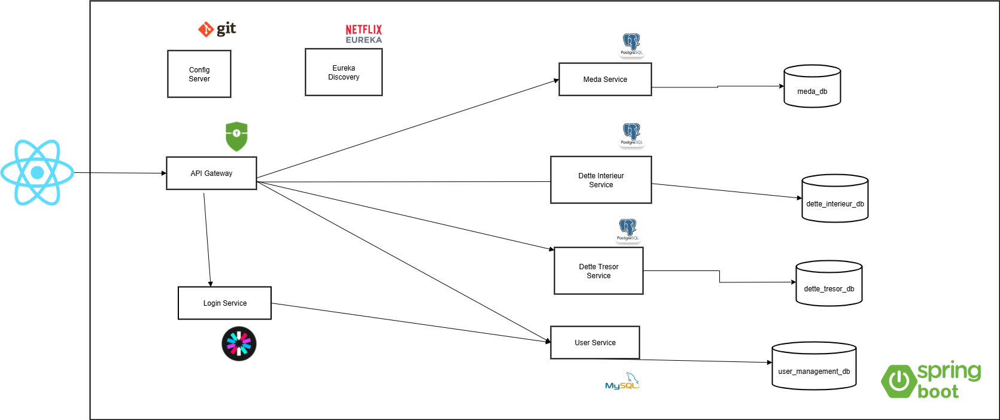

# 💼 Système Intégré de Gestion de la Dette Publique (TGR)

## 🧭 Contexte du Projet

Ce projet a été réalisé dans le cadre d'un stage au sein de la **Trésorerie Générale du Royaume (TGR)**, relevant du **Ministère de l'Économie et des Finances du Maroc**.

L'objectif principal est de concevoir et développer un **système intégré de gestion de la dette publique**, en particulier le **module de la Dette du Trésor**, afin de moderniser et centraliser les opérations financières liées à la dette de l'État.

Ce système s'inscrit dans la **stratégie de transformation digitale de la TGR**, visant à :
* Automatiser les processus financiers
* Assurer la traçabilité et la transparence des opérations
* Intégrer les partenaires externes (BAM, DTFE)
* Améliorer la sécurité et la performance des systèmes

---

## ⚙️ Aperçu Général

Le projet repose sur une **architecture microservices** basée sur **Spring Cloud** pour le backend et **React** pour le frontend.

Chaque domaine métier (Dette du Trésor, Dette Intérieure, MEDA, Utilisateurs) est isolé dans un service indépendant pour garantir modularité, sécurité et scalabilité.

### 🧩 Architecture (simplifiée)



---

## 🏦 Modules et Services

### 1️⃣ Config Server (`config-server`)
* Gère la configuration centralisée de tous les microservices.
* Port : `8888`

### 2️⃣ Discovery Server (`discovery-server`)
* Service de découverte (Netflix Eureka) pour l'enregistrement automatique.
* Port : `8761`

### 3️⃣ Gateway Server (`gateway-server`)
* API Gateway Spring Cloud Gateway.
* Routage, filtrage et sécurité.
* Port : `8080`

### 4️⃣ Login Service (`login-service`)
* Authentification et génération de tokens **JWT**.
* Port : `8083`

### 5️⃣ User Service (`user-service`)
* Gestion des utilisateurs, rôles et permissions.
* Base : **MySQL**
* Port : `8082`

### 6️⃣ Dette Trésor Service (`dette-tresor-service`)
* Gestion des prêts, échéanciers, ordres de paiement, avis de crédit/débit.
* Intégration avec **BAM** et **DTFE**.
* Génération de documents PDF.
* Base : **PostgreSQL**
* Port : `8084`

### 7️⃣ Dette Intérieure Service (`dette-interieur-service`)
* Gestion des adjudications, bons d'équipement, commissions et intérêts de dépôt.
* Base : **PostgreSQL**
* Port : configuré via Config Server

### 8️⃣ MEDA Service (`meda-service`)
* Gestion des projets de financement MEDA : avances, justificatifs, suivi financier.
* Base : **PostgreSQL**
* Port : `8085`

### 9️⃣ Frontend App (`frontend-app-v2`)
* Application web en **React + Vite + Material-UI**
* Interface responsive avec contrôle d'accès par rôles.
* Port : `5173`

---

## 🧰 Technologies Utilisées

| Domaine              | Technologies                                                                 |
| -------------------- | --------------------------------------------------------------------------- |
| **Backend**          | Java 17, Spring Boot 3.1.5, Spring Cloud 2022.0.4, JPA, Feign, JWT          |
| **Frontend**         | React 18, Vite, Material-UI, Axios, React Router                            |
| **Bases de données** | MySQL (Utilisateurs), PostgreSQL (Dette, MEDA)                              |
| **Build Tools**      | Maven, npm                                                                  |
| **Sécurité**         | JWT, Spring Security, Rôles utilisateurs                                    |
| **Outils DevOps**    | Spring Boot Actuator, Eureka Dashboard                                      |

---

## 🚀 Installation et Exécution

### 1️⃣ Prérequis
* Java 17+
* Maven 3.6+
* Node.js 16+ / npm 8+
* PostgreSQL + MySQL installés et configurés

### 2️⃣ Cloner le dépôt
```bash
git clone https://github.com/hamzasabouri/debt-management-system.git
cd debt-management-system
```

### 3️⃣ Lancer les services d'infrastructure
```bash
# Config Server
cd config-server && mvn spring-boot:run

# Discovery Server
cd discovery-server && mvn spring-boot:run

# Gateway
cd gateway-server && mvn spring-boot:run
```

### 4️⃣ Lancer les microservices métiers
```bash
cd user-service && mvn spring-boot:run
cd login-service && mvn spring-boot:run
cd dette-tresor-service && mvn spring-boot:run
cd dette-interieur-service && mvn spring-boot:run
cd meda-service && mvn spring-boot:run
```

### 5️⃣ Lancer le frontend
```bash
cd frontend-app-v2
npm install
npm run dev
```

---

## 🔐 Sécurité
* Authentification **JWT**
* Contrôle d'accès basé sur les rôles
* Communication sécurisée entre services via Gateway
* Gestion centralisée de la configuration sensible

---

## 📊 Supervision et Monitoring
* **Spring Boot Actuator** : vérification d'état des services
* **Eureka Dashboard** : suivi en temps réel
* **Logs & Metrics** : intégrés à chaque microservice

---

